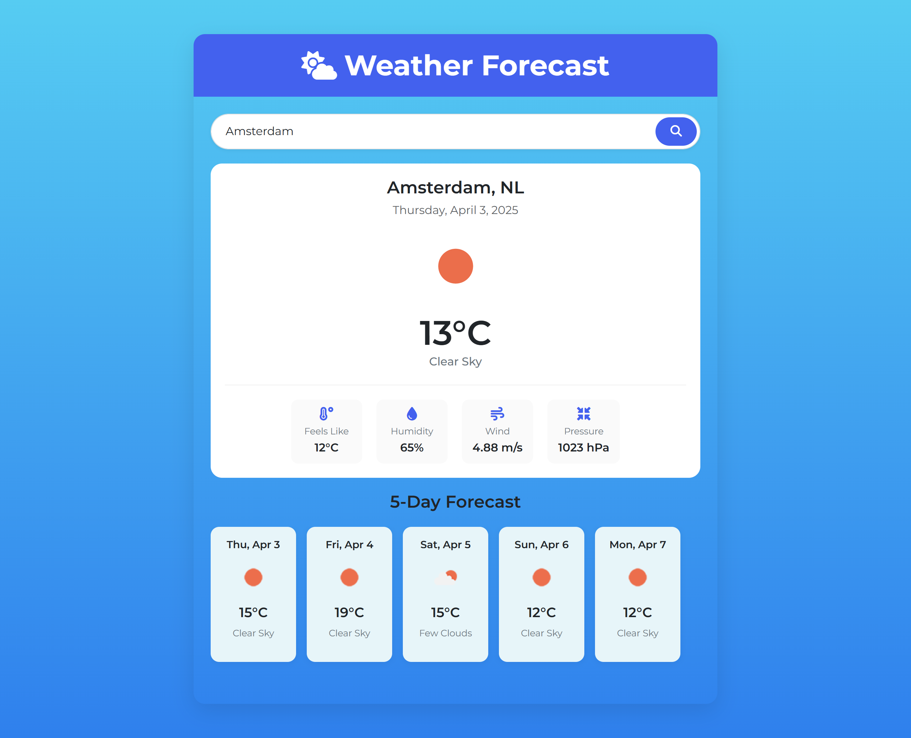
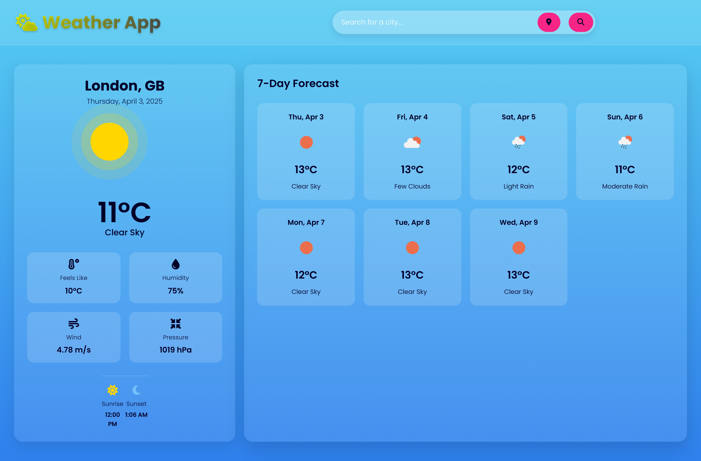

# Weather App 🌦️

## 🌦️ Overview
A modern, real-time Weather Application that provides current weather updates and a 7-day forecast for any city worldwide. Built with a sleek modern UI, it supports live location weather tracking and features a responsive design.

## 🚀 Features
- Live Weather Updates – Get real-time temperature, humidity, wind speed, and atmospheric pressure.
- 7-Day Weather Forecast – View an extended forecast for better planning.
- Search by City – Enter any city name to fetch the latest weather details.
- Live Location Support – Automatically detect and display weather for your current location.
- Modern & Responsive UI – Clean, minimal, and optimized for all screen sizes.
- Sunrise & Sunset Info – Know the exact time of sunrise and sunset in your location.

## 🛠️ Tech Stack
- Frontend: HTML, CSS, JavaScript, Bootstrap
- API: OpenWeatherMap API
- Icons: Weather Icons & Custom UI components

## Screenshots 📸
🔹 2nd iteration screenshot

🔹 3rd iteration screenshot


## 🔧 Installation
1. Clone the repository:
   ```sh
   git clone https://github.com/anjan-in/weather-app.git
   cd weather-app
   ```
2. Open `index.html` in your browser or use a live server extension.

## 🔑 API Key Setup
1. Sign up at [OpenWeatherMap](https://openweathermap.org/).
2. Get an API key.
3. Replace `YOUR_API_KEY` in `script.js`:
   ```js
   const apiKey = "YOUR_API_KEY";
   ```

## 🚀 Deployment
### GitHub Pages
1. Push the code to GitHub.
2. Enable GitHub Pages in repository settings.
3. Access the deployed app via `[anjan-in.github.io/weather-app/](https://anjan-in.github.io/weather-app/)`.

## 📜 License
This project is licensed under the MIT License - see the LICENSE file for details.

## Why This Project? 💡
- 📌 Showcases frontend development skills using JavaScript, APIs, and UI/UX principles.

- 🌍 Perfect for recruiters to see a real-world project using API integrations.

- 🚀 Demonstrates responsive design and interactive UI components.

## 💡 Contributions
Contributions are welcome! Feel free to fork the repository and submit a pull request.

💙 Made with Passion by Anjan Sen 🚀

---
🚀 Happy Coding!
